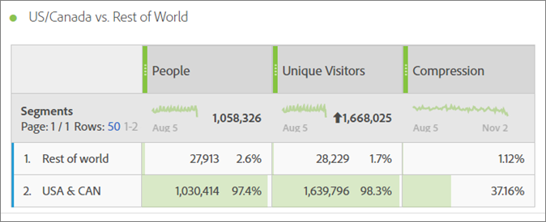

# Personmått{#people-metric}

Personmåttet är antalet personer (eller grupper av enheter) baserat på Adobe Device Graph. Du kan använda personmåttet för att identifiera besökare på olika enheter i Analysis Workspace.

## Krav och överväganden för personmått {#section-34551d0435fb4b3cb3fad736b7961541}

<table id="table_120F7EF50042485391E58B22DD00A2A8"> 
 <thead> 
  <tr> 
   <th colname="col1" class="entry"> Förutsättning eller övervägande </th> 
   <th colname="col2" class="entry"> Beskrivning </th> 
  </tr>
 </thead>
 <tbody> 
  <tr> 
   <td colname="col1"> 
Device Co-op 
 </td> 
   <td colname="col2"> 
 Om du vill använda personmåttet blir du medlem i <a href="http://landing.adobe.com/en/na/events/summit/275658-summit-co-op.html" format="html" scope="external"> Adobe Experience Cloud Device Co-op</a>. Samarbetet identifierar en persons flera enheter (eller Experience Cloud-ID). Analytics utnyttjar denna information för att statistiskt hämta antalet personer som interagerar med ett varumärke. Mätvärdet ligger inom 5 %. 
 
<b>Regioner</b>: Device Co-op är för närvarande endast tillgängligt i USA och Kanada. När du utvärderar personmätningen bör du därför tillämpa ett segment i analysen som filtrerar data enbart för USA och Kanada. 
 
Varje vecka beräknar Device Graph en ny version av co-op och publicerar den för användning. På tisdagar samlar systemet in de senaste data och publicerar en uppdaterad version av diagrammet. Experience Cloud-lösningarna använder sedan den senaste versionen av diagrammet. För Analytics är ändringarna inlästa på onsdagar och bearbetningen av ändringarna tar vanligtvis mellan 1 och 2 arbetsdagar. 
 
 
Viktigt: När diagrammet uppdateras varje vecka kan det påverka personmåttet historiskt. Med andra ord kan antalet personer ändras över tiden när diagrammet läses och uppdateras. Om du t.ex. kör en rapport i dag som räknar personer förra månaden och sedan kör samma rapport en vecka efter att diagrammet har uppdaterats, kan det historiska antalet personer ändras något. 
 
 </td> 
  </tr> 
  <tr> 
   <td colname="col1"> Måttbehörigheter </td> 
   <td colname="col2"> 
Du kan bara använda personmåttet om du har beviljats åtkomst till det. Administratörer kan<a href="https://docs.adobe.com/content/help/en/analytics/admin/user-product-management/customize-report-access/groups-metrics.html" format="html" scope="external"> anpassa behörigheter för mätvärden</a> i Admin Tools. 
 </td> 
  </tr> 
  <tr> 
   <td colname="col1"> Mappa till IMS-organisation </td> 
   <td colname="col2"> 
Personmåttet aktiveras för alla rapportsviter som <a href="https://docs.adobe.com/content/help/sv-SE/core-services/interface/about-core-services/report-suite-mapping.html" format="html" scope="external"> mappas till en IMSORG</a>. 
 </td> 
  </tr> 
  <tr> 
   <td colname="col1"> 
Analysprojekt/verktyg 
 </td> 
   <td colname="col2"> 
Använd personmåttet i  Analysis Workspace,  Ad Hoc Analysis,  Report Builderoch via API:t. Du kan använda den var du vill med de unika besökarvärdena, inklusive beräknade värden. 
 
Du kan till exempel skapa ett intäktsmått per person för att ersätta ett intäktsmått per unik besökarstatistik. 
 
A <a href="https://docs.adobe.com/content/help/sv-SE/analytics/analyze/analysis-workspace/build-workspace-project/starter-projects.html" format="html" scope="external"> Projektmall för personer</a> finns för att komma igång med personmätaren i Analysis Workspace. 
 </td> 
  </tr> 
  <tr> 
   <td colname="col1"> 
Aktivera robotregler 
 </td> 
   <td colname="col2"> 
Adobe rekommenderar att du aktiverar <a href="https://docs.adobe.com/content/help/en/analytics/admin/admin-tools/bot-removal/bot-rules.html" format="html" scope="external"> Punktregler</a>, särskilt när du använder personmåttet. 
 
När en robot crawlar din webbplats ökar antalet unika besökare på ett artificiellt sätt. Genom att ta bort robottrafiken från rapportsviten får du en exaktare mätning av aktiviteten på dina digitala resurser, både i unika besökare och i personvyn. 
 
Om du vill göra det går du till  Analyser &gt;  Administratör &gt;  Rapportsviter. Välj rätt rapportsvit och gå sedan till  Redigera inställningar &gt;  Allmänt &gt;  Punktregler. 
 </td> 
  </tr> 
  <tr> 
   <td colname="col1"> 
Segmentering 
 </td> 
   <td colname="col2"> 
 När du använder segment med personmåttet kan måttrapporteringen bli betydligt lägre än förväntat. 
 
Se <a href="../other-solutions/people.md#section-d03525420dbe48379fd95b230ef05885" format="dita" scope="local"> Använda personmått med segment</a>. 
 </td> 
  </tr> 
 </tbody> 
</table>

## Vad är personmåttet? {#section-89e2b8f5e80f480391449fc8d1117a6a}

Personmåttet är ett analysrapporteringsmått som hjälper dig att tilldela enheter till människor. Det ger en personbaserad bild av marknadsföringen, så att ni kan mäta besökarnas aktivitet på alla deras enheter. Tänk på det som en deduplicerad version av unika besökare, och du kan använda personmåttet för analys där du tidigare använt unika besökare.

**Enheter är människor**

Innan personmätningen blev tillgänglig kan en person (till exempel) besöka er webbplats och interagera med en kampanj eller ett varumärke på tre olika enheter och göra ett köp, till och med inom några minuter. Beroende på implementeringen kan Analytics rapportera varje enhet som en unik besökare och attribuera $10 till tre enheter vid ett köp på $30.

Med personmätningen kan du attribuera 30 USD till en person:

**Ökad noggrannhet i rapporter**

Med personmåttet kan du tänka på flera enheter som en enda enhet. I följande Analysis Workspace-projekt visas noggrannare jämförelser mellan Unika besökarrapporter och Personrapporter:

Jämför människor och unika besökare sida vid sida:

**Definitioner**

<table id="table_F8171AF15DA64607B427E3739EF004D6"> 
 <thead> 
  <tr> 
   <th colname="col1" class="entry"> Objekt </th> 
   <th colname="col2" class="entry"> Beskrivning </th> 
  </tr>
 </thead>
 <tbody> 
  <tr> 
   <td colname="col1"> 
Personer 
 </td> 
   <td colname="col2"> 
Personmätningen bygger på tanken att konsumenterna interagerar med ert varumärke med hjälp av flera enheter. Ju mer du segmenterar eller segmenterar data, desto mindre är chansen att samma person använder flera enheter inom det segmentet med data. 
 </td> 
  </tr> 
  <tr> 
   <td colname="col1"> 
Unika besökare 
 </td> 
   <td colname="col2"> 
Ju mer du segmenterar data efter datum eller tid, desto mindre blir skillnaden mellan Personer och unika besökare. Om du vill ha en bra förståelse för den övergripande effekten av Device Co-op rekommenderar Adobe att du använder ett datumintervall från de senaste 90 dagarna 
 </td> 
  </tr> 
  <tr> 
   <td colname="col1"> 
Komprimering 
 </td> 
   <td colname="col2"> 
Med hjälp av ett enkelt beräknat mått kan du se hur mycket mindre personmätningen är som en procentandel av Unika besökare. Klicka på infoikonen bredvid "Komprimering" i tabellen ovan för att se hur du skapar det här måttet. 
 
Människor kan användas i andra beräknade värden istället för unika besökare. 
 </td> 
  </tr> 
 </tbody> 
</table>

## Hur beräknas personmåtten? {#section-0dfb762867e14a7f927796ef3c50592b}

<!--

Analytics uses the HyperLogLog statistical algorithm to calculate People. This means that the smaller the data set, the margin for error may increase. No more than 5% of the numbers should be off by more than 5% 

-->

Följande bild visar hur personmåttet beräknas och hur det kan minska över tid för samma rapportdatumintervall tidigare.

I det här exemplet antar vi att det finns en fast uppsättning besökare. Om du har kört en rapport för en fast tidsram tidigare visas en fast uppsättning besökare. Om Device Graph matar ut data som visas på den vänstra bilden under vecka 1 resulterar det i 90 personer. En vecka senare, efter nästa körning av Device Graph, beaktas ny information. Om du kör samma rapport som du gjorde för en vecka sedan har antalet människor sjunkit till 84. Historiken har ändrats eftersom Device Graph tillhandahöll ny information om vilka enheter som ska grupperas tillsammans.

## Använda personmått med segment {#section-d03525420dbe48379fd95b230ef05885}

När du använder segment med personmåttet kan mätresultaten bli betydligt lägre än förväntat. Detta problem uppstår eftersom det inte finns något *`person`* behållare. Segmenteringen använder besökarbehållaren, som är den högsta behållaren i definitionen och som är baserad på enheten, inte på personen.

Det här problemet uppstår främst när du staplar segment med personmåttet.

Med staplingssegment skapas ett nytt segment som representerar kombinationen av segmenten. Staplingssegment skapas när du:

* Placera ett segment ovanpå ett annat segment i Analysis Workspace. (Dessa kopplas automatiskt med *`And`* -operator.)
* Använd ett segment som innehåller *`And`* -operator.
* Använd ett segment på både projektnivå och tabellnivå.
* Använd en virtuell rapportsvit med ett annat segment.

Anta till exempel att du placerar följande segment i personmåttet:

* `Campaign = Spring Promotion`
* `Site Section = Product Overview`

Endast antalet personer som är kvalificerade i båda segmenten *`using a single device`* räknas. (Personmåttet visar inte antalet kvalificerade personer på olika enheter.)

Med *`Or`* -operatorn rekommenderas inte i den här situationen. Om du gör det skulle antalet personer som såg det ena eller det andra räknas, och det går inte att räkna hur många som kvalificerar sig för båda segmenten.

Se [Bygga segment](https://docs.adobe.com/content/help/en/analytics/components/segmentation/segmentation-workflow/seg-build.html) i segmenteringshjälpen för mer information.

## Enhetstyper {#section-8ab378c84ff34574b9c20fecb3848a86}

Mätarna Device Co-op och People fungerar bäst i Adobe Analytics när rapportsviten innehåller data från flera olika enhetstyper. Om du till exempel kombinerar webb- och appdata i samma rapportsvit blir personmätningen mer kraftfull och effektiv. Ju mer enhetsövergripande data finns, desto större chans att flera unika besökare grupperas tillsammans som en person.

## Experience Cloud ID-tjänstens täckning {#section-bbf0098cac2e467289e7a644a1dea05c}

Device Co-op kräver att dina digitala egenskaper är instrumenterade med tjänsten Experience Cloud ID (MCID). Om data i rapportsviten innehåller ett stort antal besökare utan ett MCID, minskar effekten av Device Co-op och personmätningen.

<!--
mcdc-people-metric-apply.xml
-->

Skapa en [projekt](https://docs.adobe.com/content/help/en/analytics/analyze/analysis-workspace/build-workspace-project/t-freeform-project.html)och sedan dra **[!UICONTROL People]** mått till projekttabellen:

