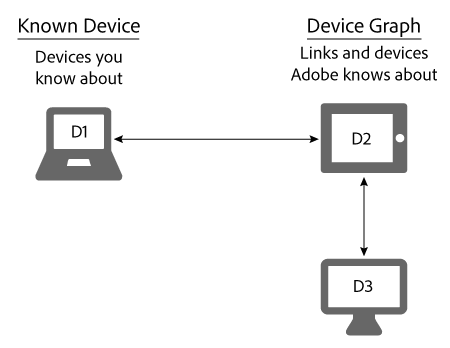

# Kända enheter{#known-devices}

Om kända enheter i Device Graph.

I Device Graph har vi begreppet *`known device`*. En känd enhet är en enhet som en kund använder för att interagera med ert varumärke.

>[!NOTE]
>
>I [!DNL Adobe Experience Cloud Device Co-op], termer som *`device`*, *`person`* o. *`identity`* .s. har en specifik betydelse. &quot;device&quot; kan till exempel avse fysisk maskinvara som en telefon eller surfplatta och de program som körs på den maskinvaran. Definitioner finns i [ordlistan](../glossary.md#glossgroup-0f47d7fbd76c4759801f565f341a386c) .

## Stödja mål med den kända enheten {#section-80deae33660e4280ac65c659ceff5601}

Det kända enhetskonceptet har stöd för ett par viktiga mål för att skapa och underhålla ett effektivt [!DNL Device Co-op] program. En känd enhet är en enhet som en [!DNL Device Co-op] medlem känner till genom någon interaktion med en konsument (t.ex. ett webbplatsbesök eller genom att använda en mobilapp). Baserat på dessa åtgärder länkar de kända enheterna för en [!DNL Device Graph] medlem till enheter som andra [!DNL Device Co-op] [!DNL Device Co-op] medlemmar bidragit med. Dessa länkar kan vara [deterministiska eller sannolika](../processes/links.md#concept-58bb7ab25f904f5f98d645e35205c931). Detta gynnar [!DNL Device Co-op] medlemmarna eftersom de får:

* Mer information om deras kända enheter.
* Ny information om andra länkade enheter.

Informationen [!DNL Device Graph] innehåller inte information om enhetskluster som en Device Co-op-medlem inte har sett.

## Mål för Device Co-op {#section-75aea5a102d54733aae2a7c6ee9ec6c7}

Tre huvudmål animerar [!DNL Device Co-op]bilden. Bland dessa finns:

* **Skala:** Dela maximalt antal möjliga länkar mellan olika användningsområden.
* **Ökthet:** Se till att varje medlem av [!DNL Device Co-op] förmånerna på ett sätt som står i proportion till deras bidrag.

* **Förtroende:** Bevara och bygga upp konsumenternas förtroende genom att säkerställa att konsumentupplevelsen på olika enheter inbegriper varumärken som de redan känner till och litar på.

## Skala och känd enhet {#section-67f734109762457ca62ec306284ea082}

Följande metoder är de vanligaste sätten som en enhet kvalificerar som en känd enhet. På grund av dessa metoder har [!DNL Device Co-op] medlemmarna nästan alltid minst en känd enhet. Detta stöder målet att ge största möjliga skala till alla medlemmar i [!DNL Device Co-op].

**Organic**

* Från kundens besök på er webbplats eller via er app. Detta är kvalificering från förstahandsdata.
* Genom att introducera nya kunder från ett CRM-system.

**Marketplace**

* Köpa segmentdata från Audience Marketplace.
* Från att köpa data från en tredjepartsleverantör.

**Reklam**

Genom att vinna lager på en auktion och leverera en annons till en enhet. Enheten blir en känd enhet om annonsen innehåller en [!DNL Audience Manager] pixel.

## Kända enheter och användningsfall för rättvisa {#section-0543188729d845d6b95db70b8b25e9f8}

Medlemmarna i gruppen får länkar som står i proportion till deras bidrag till [!DNL Device Co-op] [!DNL Device Graph]. Företag som bidrar med många enheter till [!DNL Device Graph] användarna får fler länkar än medlemmar som bara bidrar med några få. Vi anser att detta bidrar till att göra [!DNL Device Co-op] rättvisa för alla dess medlemmar. Låt oss titta på hur detta fungerar med de stora och små användningsfall som beskrivs nedan.

**Varumärke A: stor användning**

I det här exemplet har Brand A 100 webbplatsbesökare varje månad och påbörjar en ny varumärkeskampanj på olika enheter. För enkelhetens skull antar vi att alla som besöker varumärket A är länkade till ytterligare en enhet. [!DNL Device Graph] Det innebär att varumärke A kan nå ytterligare 100 enheter. Dessutom [!DNL Device Graph] innehåller det cirka 200 enheter som är kopplade till varandra.

<table id="table_78C38DC522F94BC38C1DB73740C058AC"> 
 <thead> 
  <tr> 
   <th colname="col1" class="entry"> Kända enheter/månad </th> 
   <th colname="col2" class="entry"> Länkade enheter som tagits emot från Device Co-op </th> 
   <th colname="col3" class="entry"> Totalt antal enheter för kampanj </th> 
  </tr>
 </thead>
 <tbody> 
  <tr> 
   <td colname="col1"> 
100 
 </td> 
   <td colname="col2"> 
100 
 </td> 
   <td colname="col3"> 
200 
 </td> 
  </tr> 
 </tbody> 
</table>

**Varumärke B: Gemener**

I det här exemplet har Brand B 100 webbplatsbesökare varje månad och påbörjar en ny varumärkeskampanj på olika enheter. För enkelhetens skull antar vi att alla besökare till varumärket B är [!DNL Device Graph] länkade till ytterligare 50 enheter. Det innebär att varumärke B kan nå 150 enheter. Dessutom [!DNL Device Graph] innehåller det cirka 1 000 enheter som är kopplade till varandra.

<table id="table_A6C9CCF9C6564A89BA7060E075A8E73C"> 
 <thead> 
  <tr> 
   <th colname="col1" class="entry"> Kända enheter/månad </th> 
   <th colname="col2" class="entry"> Länkade enheter som tagits emot från Device Co-op </th> 
   <th colname="col3" class="entry"> Totalt antal enheter för kampanj </th> 
  </tr>
 </thead>
 <tbody> 
  <tr> 
   <td colname="col1"> 
100 
 </td> 
   <td colname="col2"> 
50 
 </td> 
   <td colname="col3"> 
150 
 </td> 
  </tr> 
 </tbody> 
</table>

>[!MORELIKETHIS]
>
>* [Okända enheter](../processes/unknown-device.md#concept-95090d341cdc4c22ba4319d79d8f6e40)

