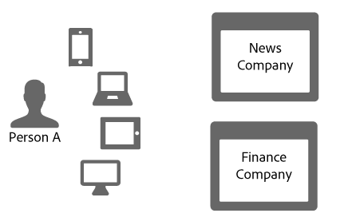
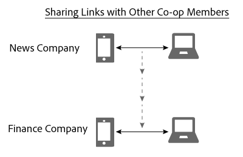

# Länkdelning i enhetsdiagram{#link-sharing-in-the-device-graph}

Om länkdelning i enhetsdiagrammet.

De delar deterministiska och sannolika länkar [!DNL Device Graph] med olika medlemmar i Adobe Experience Cloud Device Co-op. Länkdelning är det som gör det [!DNL Device Co-op] så kraftfullt. Det utökar det som varje medlem känner till om enheterna som är kopplade till en anonym person, men bara om du har sett minst en av enheterna för den anonyma personen tidigare.

## Sammanfattningsgranskning av enhetsdiagram {#section-7858e9f61b5644c981ffb53626fcc19d}

Innan vi börjar ska vi titta närmare på hur det [!DNL Device Graph] fungerar. Medlemmar i [!DNL Device Co-op] skicka data till [!DNL Device Graph]. De [!DNL Device Graph] använder dessa data för att konstruera en persons identitet utifrån [deterministiska och sannolika länkar](../processes/links.md#concept-58bb7ab25f904f5f98d645e35205c931) mellan enheter. Som [!DNL Device Co-op] deltagare ger dessa länkar insikt i relationen mellan autentiserade användare, andra användare och deras enheter. Låt oss titta på hur detta fungerar i avsnittet nedan.

## Exempel på länkdelning {#section-cb410d827cf14f76bc9b0bd4d31ed767}

I följande exempel visas möjligheterna med länkdelning i Device Co-op. I det här exemplet har vi två fiktiva företag, News Company och Finance Company. Båda företagen är medlemmar av [!DNL Device Co-op]. Person A är en konsument som antingen loggar in eller bläddrar på respektive företags webbplatser från flera olika enheter.

Eftersom person A har autentiserat sig på nyhetswebbplatsen med sin mobiltelefon och surfplatta identifierar News Company dem med ett konsument-ID. Detta ID skickas till [!DNL Device Graph] som en kryptografisk hash. Finansföretaget har sett de här enheterna förut, men person A har inte loggat in på webbplatsen. Följaktligen vet inte finansföretaget om eller hur dessa enheter är relaterade till varandra eller hur de är kopplade till person A.

Med tanke på den kryptografiska hashen för konsument-ID:t [!DNL Device Graph] vet användaren att dessa enheter är relaterade till varandra och en viss person. För företag som inte deltar i [!DNL Device Co-op] dessa besök förefaller besöken komma från separata, slumpmässiga enheter. När hash- [!DNL Device Graph] ID:t väl har hittats:

* Känns till att mobiltelefoner och bärbara datorer är kopplade till varandra.
* Europaparlamentet är medvetet om att finansföretaget vill veta om mobiltelefonen och den bärbara datorn är kopplade till varandra.

Med tanke på dessa villkor delar [!DNL Device Graph] nu länken mellan dessa enheter för News Company och Finance Company. Under den här processen duplicerar och delar [!DNL Device Graph] länken från en medverkande medlem till en annan.

Nu har rollen [!DNL Device Graph] utförts. Både News Company och Finance Company har en tydlig bild av en identitet. De kan nå Person A korrekt på alla sina enheter.

## Sekretess och länkdelning {#section-7b566018b3304420a4b3e4c079826110}

Att upprätthålla konsumenternas integritet och dataintegritet för [!DNL Device Co-op] medlemmarna är avgörande under hela länkdelningsprocessen. Under den här processen för kundidentifiering och länkdelning [!DNL Device Graph] gjorde inte följande:

* Berätta för finansföretaget att länken kom från News Company.
* Dela det kund-ID som används av en [!DNL Device Co-op] medlem med ett annat.
* Ange all annan information än den som mobilenheten och den bärbara datorn delar en gemensam länk.

## Nästa steg {#section-ac6e61f1eb6e45b1bb4be8ece39147c7}

Genom att läsa dokumentationen om identitet, länkning och länkdelning får du en bra uppfattning om hur data [!DNL Device Graph] samlas in internt. Som ett nästa steg rekommenderar vi att du tar en titt på vår dokumentation som beskriver hur konceptet med en enhet *`known device`* levererar länkar till medlemmarna i Device Co-op. Se [Kända enheter](../processes/known-device.md#concept-8e87c276819a48bfac5cef10b45216d1) och [Okända enheter](../processes/unknown-device.md#concept-95090d341cdc4c22ba4319d79d8f6e40).
